# Mystic Battle

A competitive 2-player multiplayer card game built in **Unity**, where players build decks of characters and action cards. **Match colors** strategically to launch attacks, outplay your opponent, and claim victory through clever **deck-building** and timing.

---

## 🎴 Features

- Simple card-based strategy game with color-matching combat
- Select 4 character cards and 20 action cards to build your deck
- Multiplayer powered by Unity Netcode for GameObjects (NGO)
- Card data managed with ScriptableObjects and a flexible card template system
- Validation system ensures proper builds
- Smooth and stylish UI powered by DoTween animations

---

## 🖼️ Screenshots

### Main Menu  
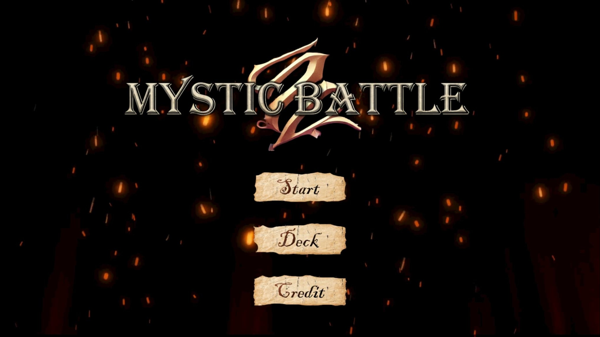

### Deck Editor
|  |
|:--------------------------:|
| 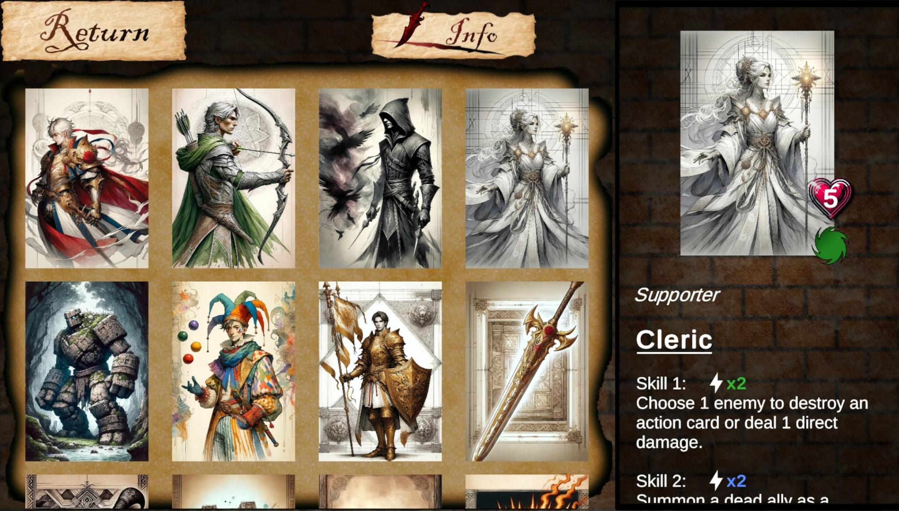 |
| **Card Info** |
| 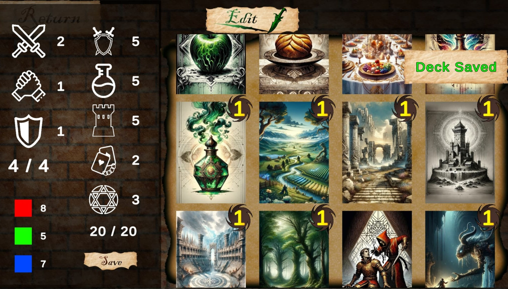 |
| **Deck Building** |

### Lobby Creation
|                                |                                |
|:------------------------------:|:------------------------------:|
| 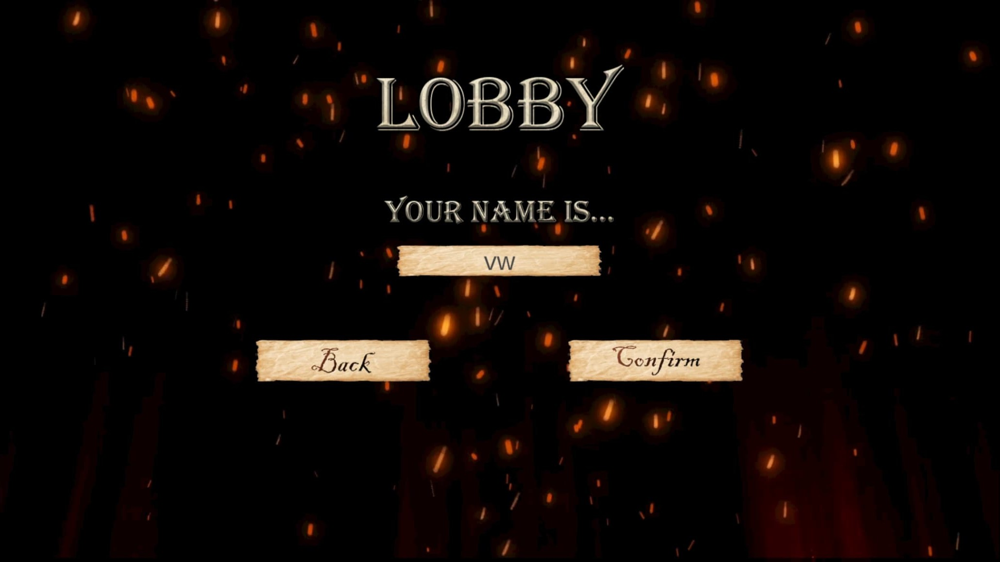 | 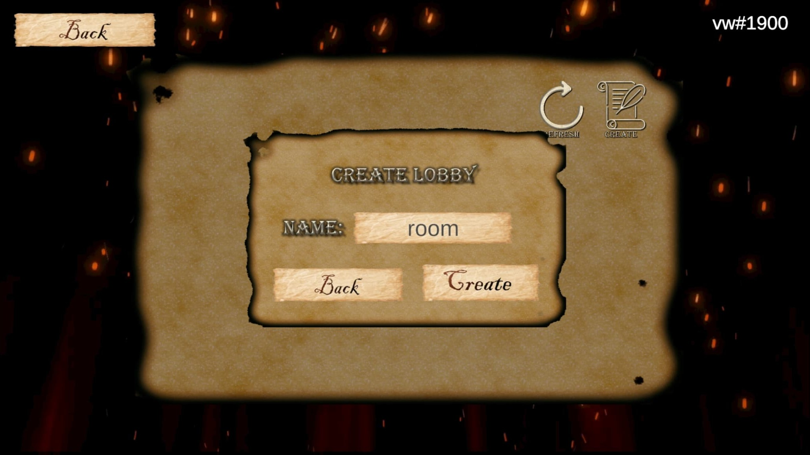 |
| **Lobby Create 1**            | **Lobby Create 2**            |
| 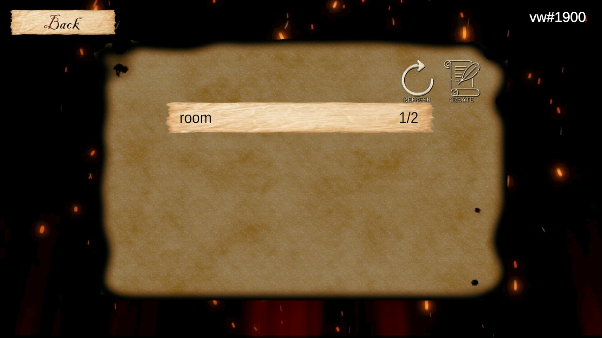  | 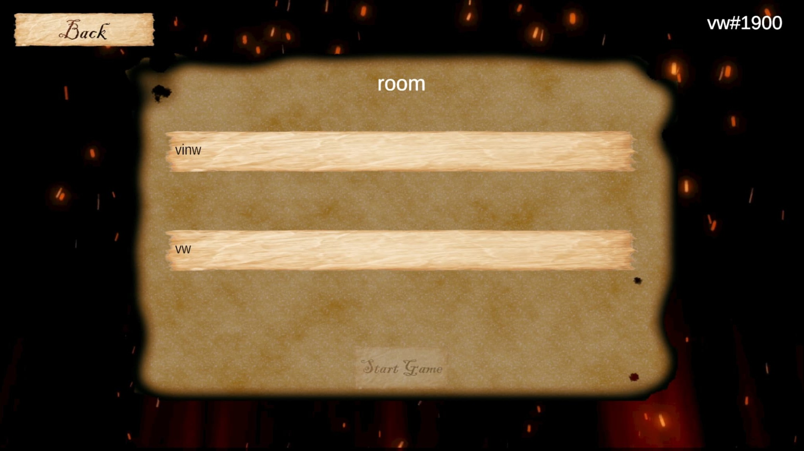     |
| **Lobby Search**              | **Game Room**                 |

### Tutorial
|                                |                                |
|:------------------------------:|:------------------------------:|
| 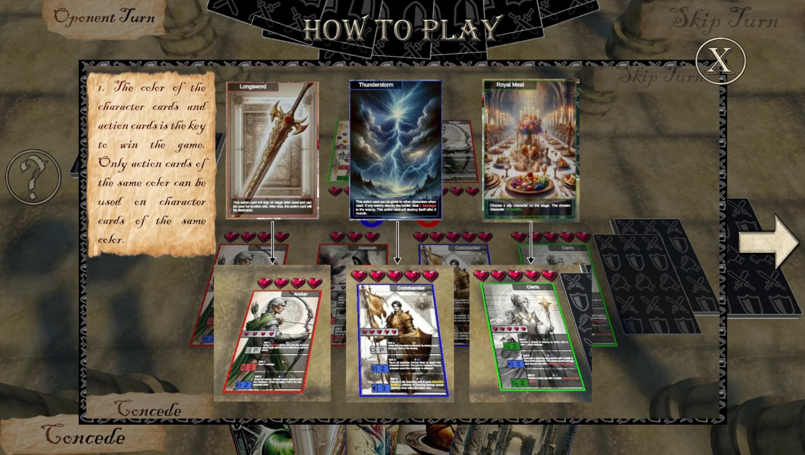 | 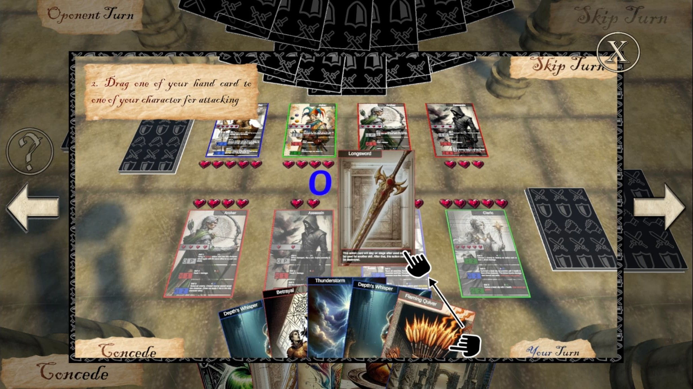 |
| **Tutorial 1**                | **Tutorial 2**                |
| 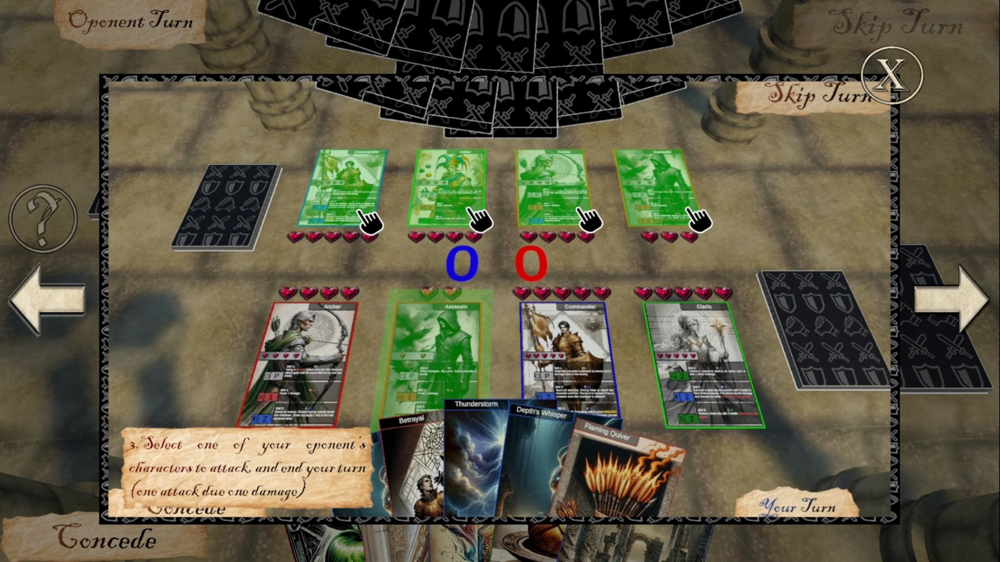 | 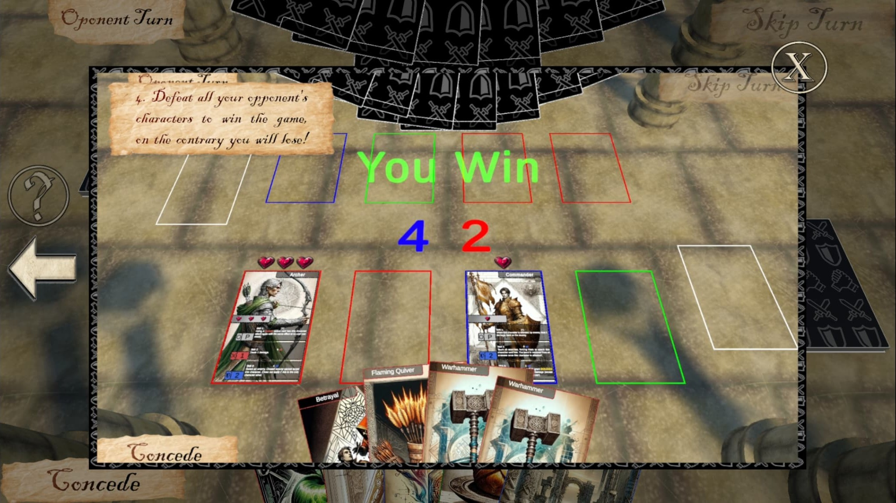 |
| **Tutorial 3**                | **Tutorial 4**                |

### Card Preview
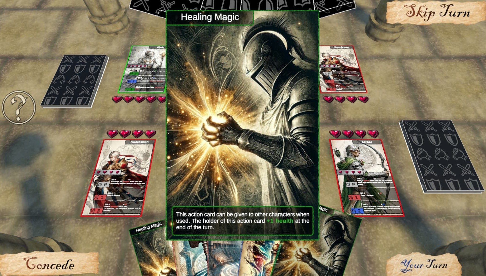

### Attack
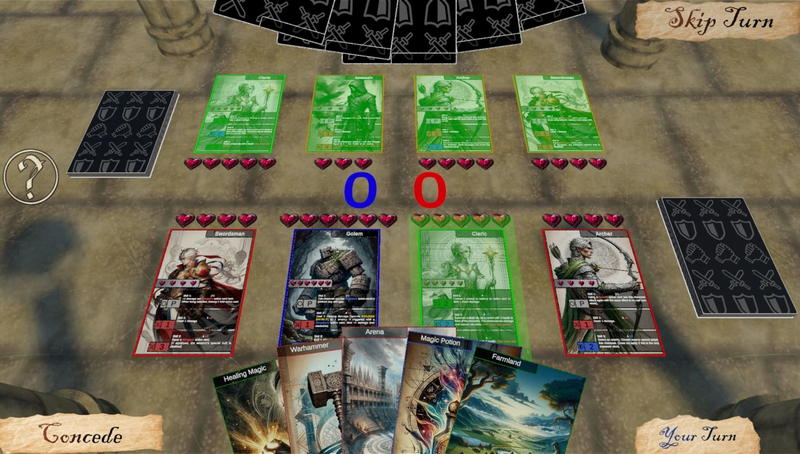

### VFX
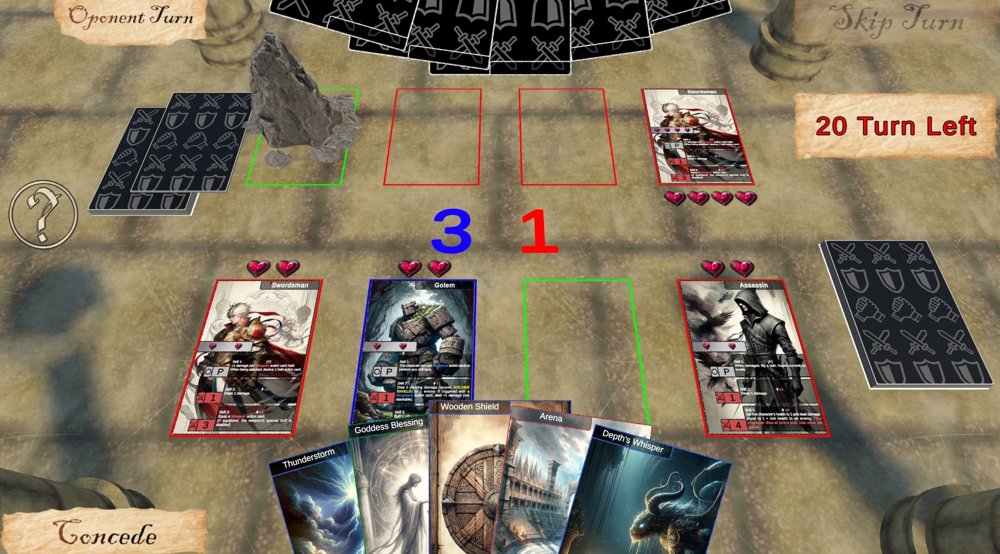

### Game Over / Victory
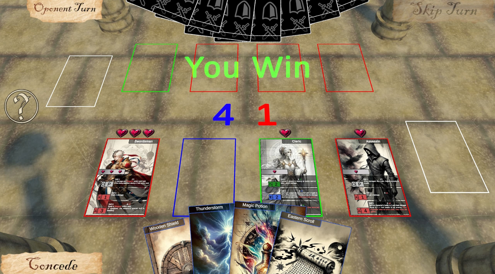

---

## 📽️ Gameplay

  

